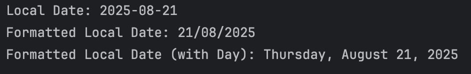
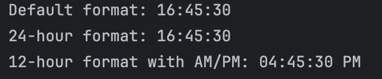
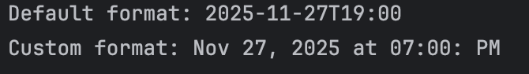
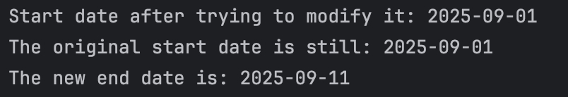
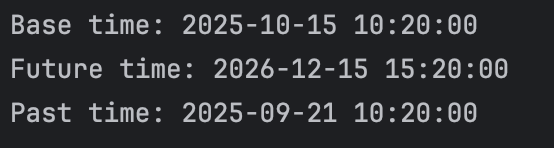

# Exploring Java Date and Time API
Submitted by: Baruc, Jana Enigma S.

### Exercise 1: `LocalDate` and `DateTimeFormatter`
1. **Prediction**: `Local Date: 2025-08-21`, `Formatted Local Date: 21/08/2025`, `Formatted Local Date (with Day): Thursday, August 21, 2025`
    * `LocalDate.of()` will return the specific date without any formatting. To format the dates specifically, `DateFormatter` must be used. In this case, `DateFormatter.ofPattern()` was used to achieve the specific formats required.
2. **Observation/Output**

### Exercise 2: `LocalTime` and `DateTimeFormatter`
1. **Prediction**: `Default format: 16:45:30`, `24-hour format: 16:45:30`, `12-hour format with AM/PM: 4:45:30 PM`
    * `LocalTime.of()` will return the specific time without any formatting. To format the times specifically, similar to dates, `DateFormatter` must be used. In this case, `DateFormatter.ofPattern()` was used to achieve the specific formats required. For time formats, `HH` is used for 24-hour formats, while `hh` is used for 12-hour formats, along with `a` which signifies AM or PM.
2. **Observation/Output**

### Exercise 3: `LocalDateTime` and `DateTimeFormatter`
1. **Prediction**: `Default format: 2025-11-27T19:00:00`, `Custom format: Nov 27, 2025 at 7:00 PM`
    * `LocalDateTime.of()` will return the specific date and time without any formatting. To format this, `DateFormatter` must be used. In this case, `DateFormatter.ofPattern()` was used to achieve the specific formats required. `MMM` is used to print the abbreviated month (in this case "Nov" for "November").
2. **Observation/Output**

### Exercise 4: The Immutability of Date-Time Objects
1. **Prediction**: `Start date after trying to modify it: 2025-09-01`, `The original start date is still: 2025-09-01`, `The new end date is: 2025-09-11`
    * The first attempt to modify `startDate` does not change the date because Date-Time objects are immutable. They have to be stored in a new Date-Time object in order to "modify" them.
2. **Observation/Output**

### Exercise 5: Adding and Subtracting Time (`plus` and `minus`)
1. **Prediction**: `Base Time: 2025-10-15 10:20:00`, `Future time: 2026-12-15 15:20:00`, `Past time: 2025-09-21 10:20:00`
    * The code will simply print the dates and times in accordance to the `plus` and  `minus` methods provided.
2. **Observation/Output**

